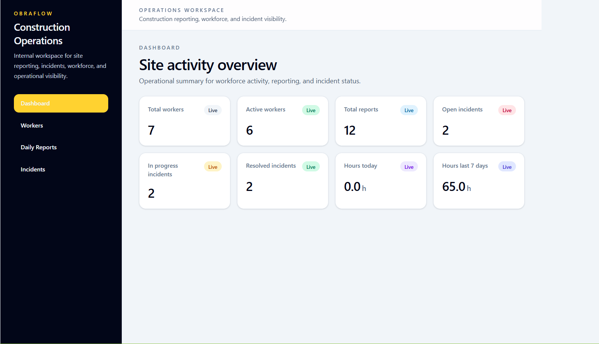
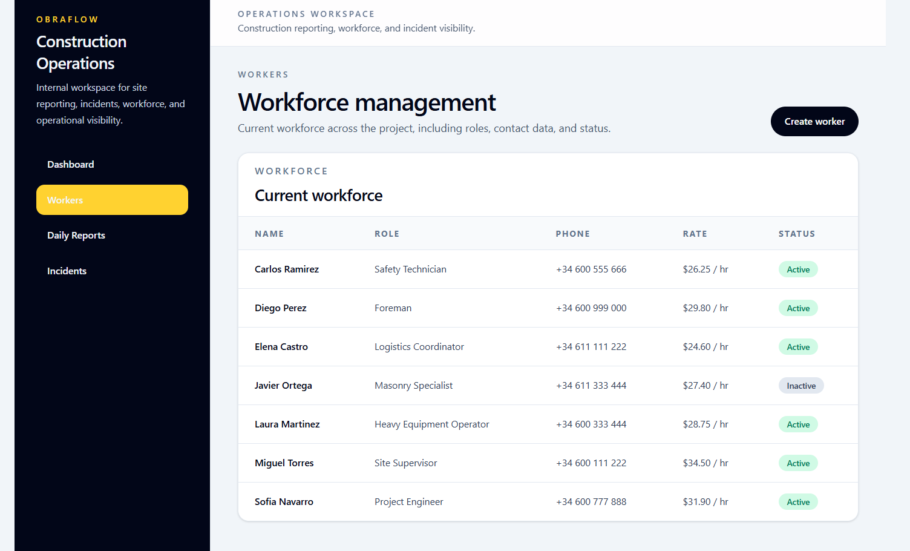
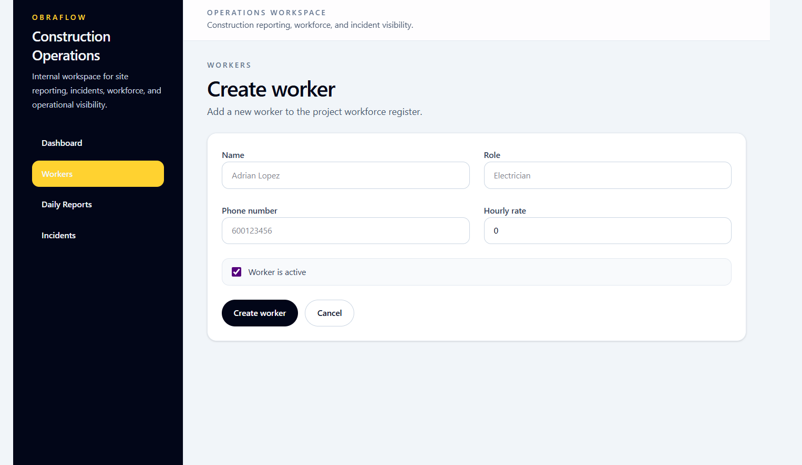
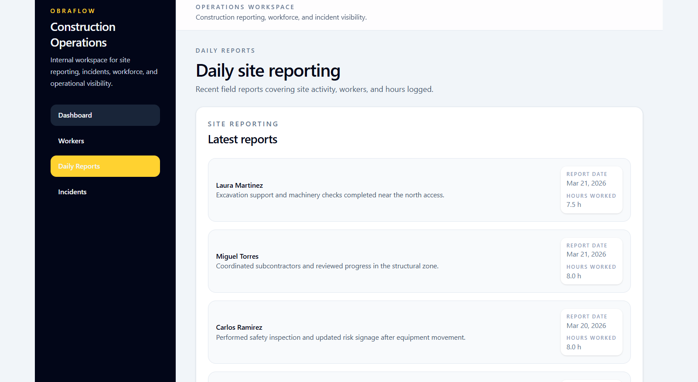

# ObraFlow

ObraFlow is a construction operations MVP designed to simulate real-world site management workflows, including workforce tracking, reporting, incident handling, and operational dashboards.

The project is intentionally built with production-oriented practices such as integration testing, deterministic seed data, and demo environment protection.

It replaces fragmented workflows such as paper-based reports, informal incident tracking, and unstructured workforce management with a structured digital workflow.




## Current Product Scope

Implemented today:

- dashboard summary connected end-to-end
- workers list and create flow
- daily reports list
- incidents list
- ASP.NET Core backend with PostgreSQL persistence
- React frontend consuming the backend API

## Stack

### Backend

- .NET 10
- ASP.NET Core Web API
- Entity Framework Core 10
- PostgreSQL
- xUnit + FluentAssertions

### Frontend

- React
- Vite
- TypeScript
- Tailwind CSS
- TanStack Query
- Axios
- React Hook Form
- Zod

### Infrastructure

- Docker Compose
- PostgreSQL 16
- Swagger / OpenAPI

## Architecture

The repository is organized as a monorepo:

- `backend/` contains the layered .NET backend
- `frontend/` contains the React application

The backend follows four layers:

- `Domain`: entities and enums
- `Application`: DTOs and service contracts
- `Infrastructure`: EF Core, PostgreSQL, migrations, service implementations
- `Api`: controllers, HTTP pipeline, Swagger, runtime configuration

The frontend stays isolated and consumes the backend API only.

## Testing

The backend is validated with integration tests built on `WebApplicationFactory` and xUnit.

Current coverage includes:

- workers endpoints
- daily reports endpoints
- incidents endpoints
- dashboard endpoint
- demo write rate limiting
- demo database reset behavior

These tests exercise the real API surface without mocking the HTTP layer.

## How To Run Locally

### Backend with Docker

```bash
docker compose -f backend/docker-compose.yml up --build
```

URLs:

- API: `http://localhost:5000`
- Swagger: `http://localhost:5000/swagger`

### Backend without Docker

```bash
dotnet run --project backend/src/ObraFlow.Api/ObraFlow.Api.csproj
```

URLs:

- API: `http://localhost:5250`
- Swagger: `http://localhost:5250/swagger`

### Frontend

```bash
cd frontend
pnpm install
pnpm dev
```

Default URL:

- App: `http://localhost:5173`

The frontend uses `VITE_API_BASE_URL` when provided and falls back to `http://localhost:5250`.

## Public Demo Behavior

The backend includes lightweight demo protection to keep shared environments usable.

- write rate limiting can be enabled for public demo mode
- protected `POST` endpoints are limited per client IP
- the demo database can be reset to a deterministic seeded state

Supported protected endpoints:

- `POST /workers`
- `POST /daily-reports`
- `POST /incidents`

The demo reset entry point is available through:

```bash
dotnet run --project backend/src/ObraFlow.Api/ObraFlow.Api.csproj -- reset-demo
```

## Screenshots

### Operational Dashboard


### Workforce Management



### Worker Onboarding Flow



### Incident Tracking



## Docs

- backend overview: `backend/README.md`
- backend docs index: `backend/docs/index.md`
- frontend architecture: `frontend/docs/frontend-architecture.md`

ObraFlow is presented as a portfolio-ready backend and frontend system built with production-oriented practices, not as a demo-only prototype.
